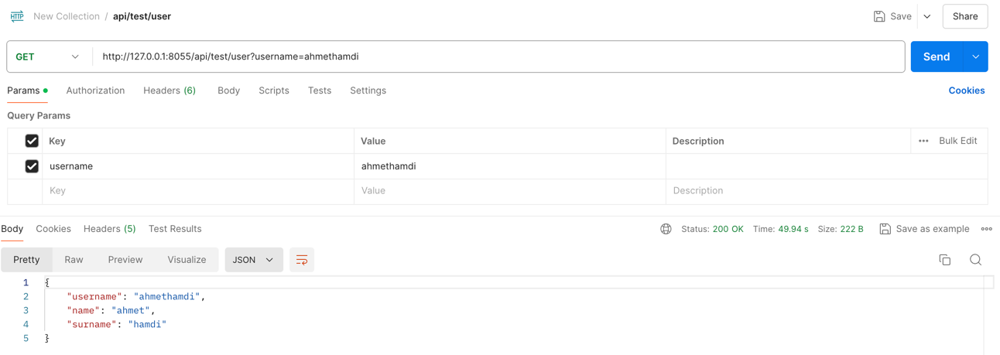
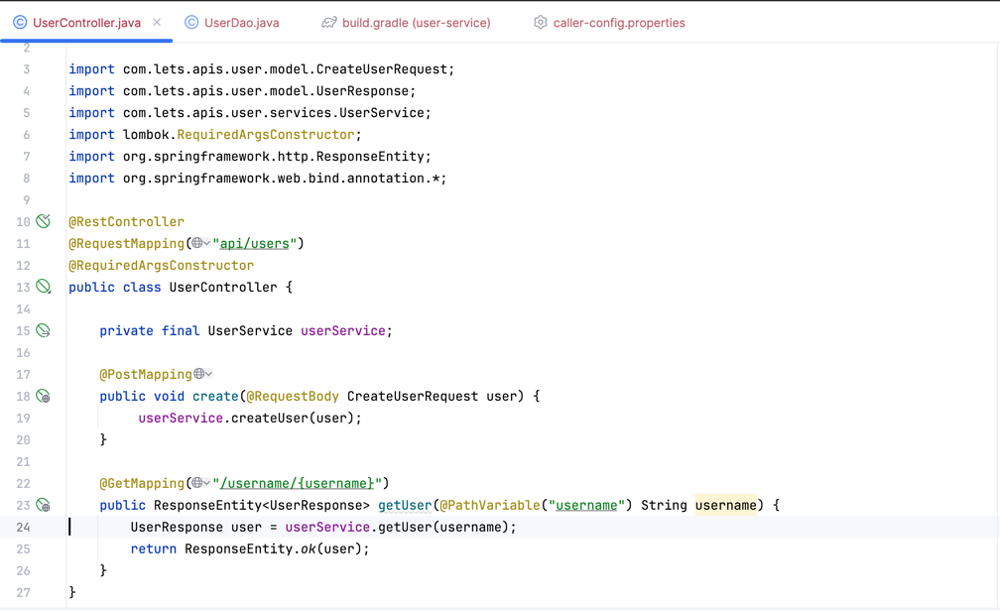
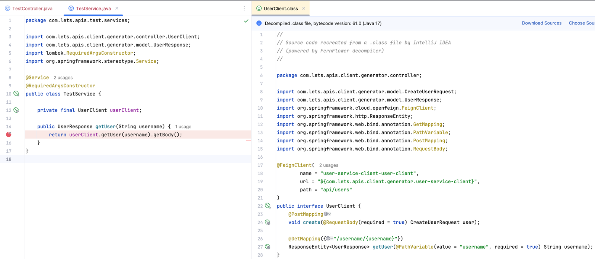

**FEING API-CALLER GENERATE AND USAGE TEST**

**user-service** : http://127.0.0.1:8055/api/test

caller-config.properties :

    com.lets.apis.client.generator.java-version= 17
    com.lets.apis.client.generator.gradle-version= 8.5
    com.lets.apis.client.generator.scan-package= com.lets.apis.user
    com.lets.apis.client.generator.api-name= user-service-client
    com.lets.apis.client.generator.api-version= 1.0.0
    com.lets.apis.client.generator.api-client-path=
    com.lets.apis.client.generator.dependencies= []

build.gradle : 

    repositories {
        maven { // lets-api-client-generator pull repo
            url = uri("https://maven.pkg.github.com/vuraltamer/lets-api-client-generator")
            credentials {
                username = project.findProperty("gpr.user") ?: System.getenv("GITHUB_USERNAME")
                password = project.findProperty("gpr.token") ?: System.getenv("GITHUB_TOKEN")
            }
        }
        maven { // for your client jars pull repo
            url = uri("https://maven.pkg.github.com/vuraltamer/feign-client-generator-test")
            credentials {
                username = project.findProperty("gpr.user") ?: System.getenv("GITHUB_USERNAME")
                password = project.findProperty("gpr.token") ?: System.getenv("GITHUB_TOKEN")
            }
        }
        gradlePluginPortal()
        mavenCentral()
    }
    
    publishing { // publishin your client jar 
        publications {
        mavenJava(MavenPublication) {
            artifact(".generator/user-service-client/build/libs/user-service-client-1.0.0.jar")
            groupId = "io.github.lets.apis.client"
            artifactId = "user-service-client"
            version = "1.0.0"
        }
    }
    repositories {
        maven {
            name = "GitHubPackages"
            url = uri("https://maven.pkg.github.com/vuraltamer/feign-client-generator-test")
            credentials {
                username = project.findProperty("gpr.user") ?: System.getenv("GITHUB_USERNAME")
                password = project.findProperty("gpr.token") ?: System.getenv("GITHUB_TOKEN")
            }
        }
    }

    dependencies {
        implementation 'io.github.lets.apis.client.generator:lets-api-client-generator:1.0.0'
    }

    apply from: 'https://raw.githubusercontent.com/vuraltamer/lets-api-client-generator/refs/heads/master/doc/generate-client.gradle'

run this for user-service :

    gradle generateApiClientJar publish

check github packages for your client jar

**test-service** : http://127.0.0.1:8055/api/user

build.gradle :

    repositories {
        maven { // for your client jars pull repo
            url = uri("https://maven.pkg.github.com/vuraltamer/feign-client-generator-test")
            credentials {
                username = project.findProperty("gpr.user") ?: System.getenv("GITHUB_USERNAME")
                password = project.findProperty("gpr.token") ?: System.getenv("GITHUB_TOKEN")
            }
        }
        gradlePluginPortal()
        mavenCentral()
    }

    dependencies {
        implementation 'io.github.lets.apis.client:user-service-client:1.0.0'
    }

try this :

